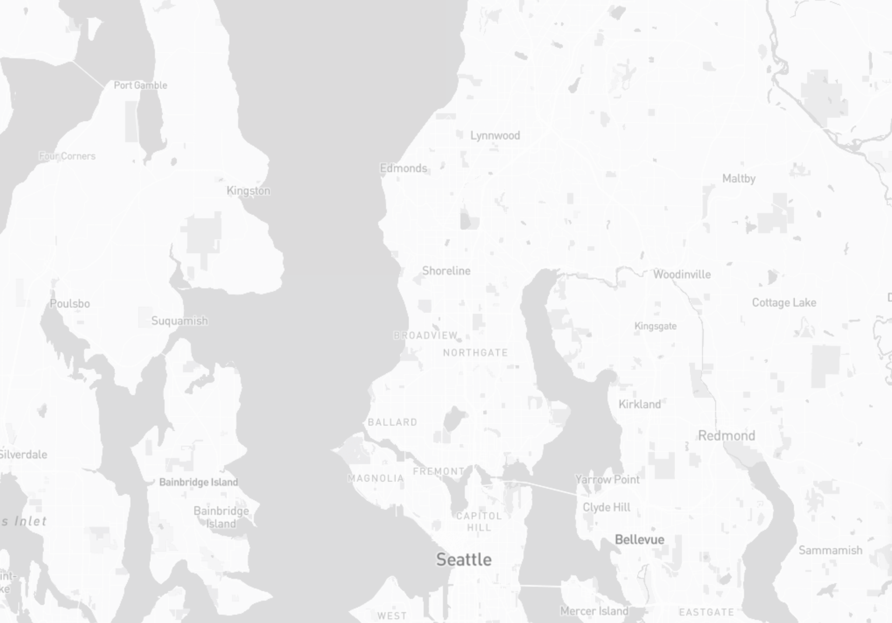
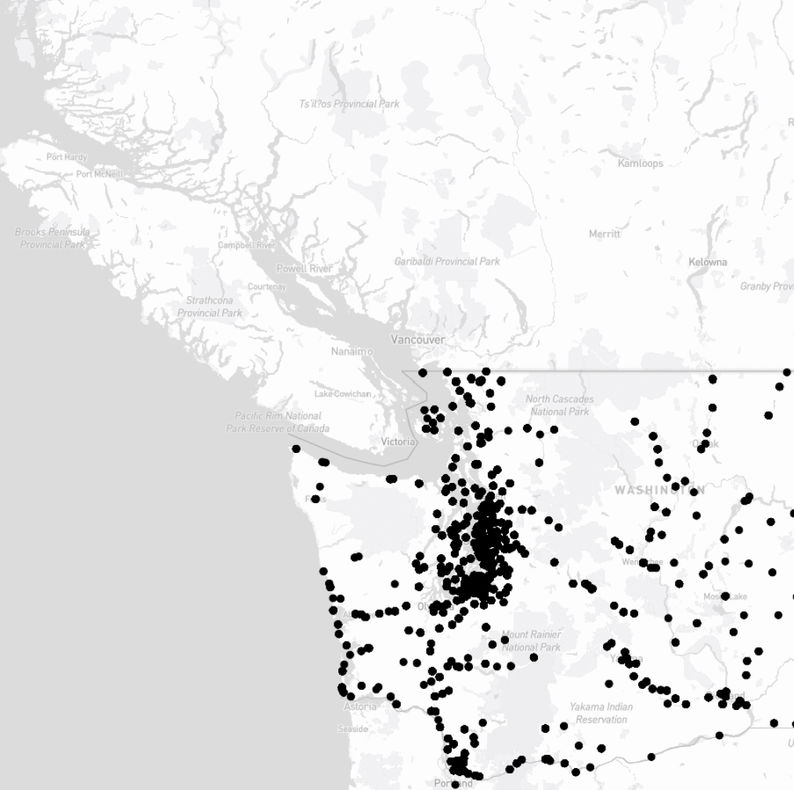

# Group AB 4 - Electric Vehicle Adoption Trends in WA State
Team members: Jasmine So, Darwin Lopez, Abhinav Chandra Cherukuri, Shenhan Xu 

Project URL:

## Overview - Explore the Electric Vehicle Adoption Trends in Washington State

Electric vehicles use one or more electric motors for propulsion and they are one of the main technologies to decarbonise road transport. They can either be powered by a collector system with electricity from extravehicle sources, or it can be powered autonomously by a battery. During the late 2000s, governments began their incentives to increase adoption of electric vehicles. We can see exponential growth in the sales of electric vehicles with improved range, more model availability and increased performance.

**The aim of this project is to understand the adoption trends of electric vehicles through demographic and geographic factors that influence growth in Washington State.**

## Project significance and broader impacts

This project should acknowledge that electric vehicles are just one part of a broader transition to sustainable transportation systems and encourage policymakers to consider other solutions, such as public transit and active transportation.

## Primary functions and major data sources

This project analyzes and visualizes the growth and distribution of electric vehicles and plug-in hybrid electric vehicles in Washington State. 

Our dataset is from `Data.WA.gov`, `“Electric Vehicle Population Data”` which shows the **Battery Electric Vehicles (BEVs)** and **Plug-in Hybrid Electric Vehicles (PHEVs)** that are currently registered through Washington State Department of Licensing (DOL). The data is created on **April 16th in 2019**, provided by the Washington State Department of Licensing (DOL) and owned by the Department of Licensing. The data will be cleaned and displayed as maps, graphs, charts, and comprehensive analysis. The aim of this project is to look into adoption trends of electric vehicles through demographic and geographic factors that influenced growth in the state.

Major data source: [WA state Electrical Vehicle Population Data](https://data.wa.gov/Transportation/Electric-Vehicle-Population-Data/f6w7-q2d2)

## Target audience

This dataset mainly targets the **government** and **car companies** to study customer interests and the locations(city, state, census tracts variables) that buy the most Battery Electric Vehicles (BEVs) and Plug-in Hybrid Electric Vehicles. 

## Multimedia
 - Basemap
 
 - Dot Density Map
 
 - Heatmap
 

## Applied libraries & Web Services
- Mapbox 
- github 
- basemap

## Other Data Sources
- Article: [A new report on our electric future](https://t4america.org/2023/01/20/sparking-progress-report/)
- Article: [Study finds that smart charging strategies can help U.S. prepare for surge in electric vehicle usage
](https://www.geekwire.com/2020/study-finds-smart-charging-strategies-can-help-u-s-prepare-surge-electric-vehicle-usage/) 
- [Wanting to have more electric vehicles in King County](https://www.youtube.com/watch?v=qeWYDfVvH1s)
- [Electric Vehicle Tax Credit](https://www.youtube.com/watch?v=N7qdFRbv-i8)
